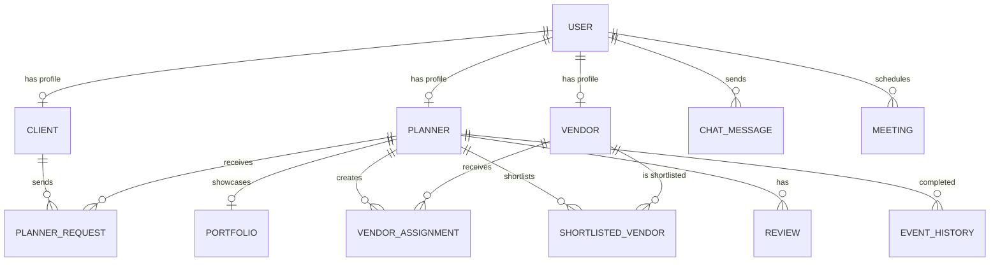

<p align="center">
  
</p>

<h1 align="center">EvenAfter</h1>

<p align="center">
  <strong>An AI-Powered Luxury Wedding Planning Marketplace</strong><br/>
  <em>Connecting couples, elite planners, and premium vendors on one platform.</em>
</p>

<p align="center">
  
  
  
  
  
  
  
  
  
</p>

<p align="center">
  <a href="#features">Features</a> &bull;
  <a href="#architecture">Architecture</a> &bull;
  <a href="#tech-stack">Tech Stack</a> &bull;
  <a href="#getting-started">Getting Started</a> &bull;
  <a href="#api-reference">API Reference</a> &bull;
  <a href="#project-structure">Structure</a> &bull;
  <a href="#contributing">Contributing</a>
</p>

---

## About

**EvenAfter** is a full-stack luxury wedding planning marketplace built with the MERN stack. It provides a premium, rose-gold-themed interface with elegant animations, connecting three key stakeholders in the wedding ecosystem:

| **Couples** | **Wedding Planners** | **Vendors** |
|:---:|:---:|:---:|
| Browse and hire verified planners | Accept client proposals and manage weddings | Receive job assignments and showcase portfolio |
| Track wedding tasks and timeline | Discover, shortlist, and assign vendors | Accept or reject bookings in real-time |
| Schedule meetings and chat directly | Manage budgets and coordinate events | Update availability and connect with planners |

---

## Features

### Authentication and Security
- JWT-based authentication with HTTP-only cookie sessions
- Role-based access control with separate dashboards for Client, Planner, and Vendor
- Secure password hashing with bcrypt
- Protected API routes with middleware verification

### Client Portal
- **Discover Planners** — Browse verified wedding planners with ratings, specializations, and portfolios
- **Hire Planners** — Send detailed wedding proposals with budget, theme, and requirements
- **Schedule Meetings** — Book Google Meet, Zoom, or internal video consultations
- **Real-time Chat** — Direct messaging with assigned planners via Socket.io
- **Profile Management** — Edit wedding details, partner info, budget, and photos
- **Task Tracking** — Monitor wedding checklist and upcoming meetings

### Planner Portal
- **Manage Proposals** — Accept or reject incoming client hiring requests
- **Vendor Registry** — Browse, search, and filter vendors by category, location, and availability
- **Shortlist Vendors** — Save preferred vendors for quick access
- **Assign Vendors** — Assign vendors to specific weddings with role, budget, and timeline
- **Dashboard Analytics** — Track active clients, pending requests, and performance metrics
- **Client Communication** — Real-time chat with all connected clients

### Vendor Portal
- **Job Assignments** — Receive and respond to wedding assignments from planners
- **Availability Management** — Live status switcher (Available, Busy, Booked, Offline, Vacation)
- **Business Dashboard** — Track total weddings, connected planners, and completed ceremonies
- **Real-time Notifications** — Instant alerts for new assignments via WebSocket
- **Planner Communication** — Direct chat with connected planners

### AI Planner Assistant
- **Personalized Chatbot** — Interactive floating wedding planning assistant powered by the Gemini API
- **Exclusively Client Role** — Tailored exclusively to brides, grooms, and clients on the client dashboard
- **Planning Domain Memory** — Retains session chat history and provides customized venue, decoration, catering, budgeting, and timeline ideas

### Admin Dashboard & Event Monitoring
- **Overview Metrics** — Complete monitoring of active, completed, and upcoming platform celebrations
- **Read-Only Supervision** — Non-intrusive event details view displaying detailed client cards, lead planners, and assigned vendors
- **Status & Progress Tracking** — Visual progress trackers, milestones timeline lists, and budget breakdowns (spent vs allocated categories)
- **Communication Audit** — Access logs to review planner-client chat history logs

### Design and UX
- **Luxury Rose-Gold Theme** — Premium ivory, champagne, and sage color palette
- **Falling Flower Petals** — CSS-animated floral overlay on the landing page
- **Dark Mode** — Elegant gold-accent dark theme with seamless toggle
- **Framer Motion Animations** — Smooth page transitions and micro-interactions
- **Fully Responsive** — Mobile-first design with collapsible sidebars
- **Premium Typography** — Playfair Display serif paired with Roboto sans-serif

---

## Architecture

```
+-------------------------------------------------------------+
|                        CLIENT BROWSER                       |
|                                                             |
|  +----------+  +----------+  +----------+  +------------+   |
|  |  Client  |  | Planner  |  |  Vendor  |  |  Landing   |   |
|  |Dashboard |  |Dashboard |  |Dashboard |  |   Page     |   |
|  +----+-----+  +----+-----+  +----+-----+  +------------+   |
|       |              |              |             |         |
|  +----+--------------+--------------+------------------+    |
|  |                React + React Query                  |    |
|  |              (Vite Dev Server / Build)              |    |
|  +---------------+-------------------------------------+    |
+------------------+------------------------------------------+
                   |  HTTP (REST)  +  WebSocket (Socket.io)
                   |
+------------------+------------------------------------------+
|                  |         EXPRESS SERVER                   |
|  +---------------+---------------------------------------+  |
|  |                Middleware Layer                          |  |
|  |           (JWT Auth, CORS, Error Handler)                      |  |
|  +---------------+---------------------------------------+  |
|                  |                                          |
|  +-------+-------+-------+-------+-------+-------+          |
|  | Auth  |Client |Planner|Vendor | Chat  |Meeting|          |
|  |Routes |Routes |Routes |Routes |Routes |Routes |          |
|  +---+---+---+---+---+---+---+---+---+---+---+---+          |
|      +-------+-------+---+-------+-------+                  |
|                          |                                  |
|              +-----------+-----------+                      |
|              |    MongoDB Atlas      |                      |
|              |    (Mongoose ODM)     |                      |
|              +-----------------------+                      |
+-------------------------------------------------------------+
```

---

## Tech Stack

### Frontend

| Technology | Purpose |
|-----------|---------|
| React 19 | UI component library |
| Vite | Build tool and dev server |
| Tailwind CSS | Utility-first CSS framework |
| Framer Motion | Declarative animations and page transitions |
| React Query | Server state management and caching |
| React Router v7 | Client-side routing with nested layouts |
| Socket.io Client | Real-time bidirectional communication |
| React Icons | Icon library (Feather icons) |

### Backend

| Technology | Purpose |
|-----------|---------|
| Node.js | JavaScript runtime |
| Express.js | Web application framework |
| MongoDB Atlas | Cloud-hosted NoSQL database |
| Mongoose | MongoDB object modeling (ODM) |
| JWT | Stateless authentication tokens |
| bcryptjs | Secure password hashing |
| Socket.io | Real-time WebSocket server |
| cookie-parser | HTTP cookie parsing middleware |
| nodemon | Auto-restart dev server on file changes |

---

## Getting Started

### Prerequisites

- **Node.js** v18 or later — [Download](https://nodejs.org/)
- **MongoDB Atlas** account — [Sign up](https://www.mongodb.com/atlas) (or local MongoDB)
- **Git** — [Download](https://git-scm.com/)

### Installation

```bash
# 1. Clone the repository
git clone https://github.com/saavi122/EvenAfter-A-Wedding-Planner-.git
cd EvenAfter-A-Wedding-Planner-

# 2. Install backend dependencies
npm install

# 3. Install frontend dependencies
cd frontend
npm install
cd ..
```

### Environment Setup

Create a `.env` file in the root directory:

```env
# Server
PORT=5000

# MongoDB
MONGO_URI=mongodb+srv://<username>:<password>@cluster0.xxxxx.mongodb.net/evenafter?retryWrites=true&w=majority

# JWT Authentication
JWT_SECRET=your_super_secret_jwt_key_here
JWT_EXPIRES_IN=1d
ACCESS_TOKEN_SECRET=your_super_secret_jwt_key_here
ACCESS_TOKEN_EXPIRY=1d

# Refresh Token
REFRESH_TOKEN_SECRET=your_refresh_token_secret_here
REFRESH_TOKEN_EXPIRY=7d

# CORS
CORS_ORIGIN=*
```

### Running the Application

```bash
# Terminal 1 — Start the backend server (port 5000)
npm start

# Terminal 2 — Start the frontend dev server (port 5173)
cd frontend
npm run dev
```

Open **http://localhost:5173** in your browser.

---

## API Reference

> Base URL: `http://localhost:5000/api`

### Authentication — `/api/auth`

| Method | Endpoint | Auth | Description |
|--------|----------|------|-------------|
| `POST` | `/auth/register` | No | Register a new user (client, planner, or vendor) |
| `POST` | `/auth/login` | No | Login and receive a JWT cookie |
| `POST` | `/auth/logout` | Yes | Clear session cookie |
| `GET` | `/auth/me` | Yes | Get current user and role profile |
| `GET` | `/auth/user/:userId` | Yes | Get a user's public profile |

### Client — `/api/client`

| Method | Endpoint | Auth | Description |
|--------|----------|------|-------------|
| `GET` | `/client/profile` | Yes | Get client profile with wedding details |
| `PUT` | `/client/profile` | Yes | Update profile, wedding date, budget |
| `GET` | `/client/my-planner` | Yes | Get hired planner, tasks, and meetings |

### Planners — `/api/planners`

| Method | Endpoint | Auth | Description |
|--------|----------|------|-------------|
| `GET` | `/planners` | Yes | List all active planners |
| `GET` | `/planners/:id` | Yes | Get planner details by ID |
| `GET` | `/planners/:id/portfolio` | Yes | Get planner portfolio gallery |
| `GET` | `/planners/:id/events` | Yes | Get planner event history |
| `GET` | `/planners/:id/reviews` | Yes | Get planner client reviews |

### Vendors — `/api/vendors`

| Method | Endpoint | Auth | Description |
|--------|----------|------|-------------|
| `GET` | `/vendors` | Yes | List all active vendors |
| `GET` | `/vendors/:id` | Yes | Get vendor profile and reviews |
| `PUT` | `/vendors/profile` | Yes | Update vendor profile and availability |
| `POST` | `/vendors/shortlist` | Yes | Planner shortlists a vendor |
| `GET` | `/vendors/shortlist/planner` | Yes | Get planner shortlisted vendors |

### Chat — `/api/chat`

| Method | Endpoint | Auth | Description |
|--------|----------|------|-------------|
| `GET` | `/chat/conversations` | Yes | Get all conversation threads |
| `GET` | `/chat/:receiverId` | Yes | Get messages with a specific user |
| `POST` | `/chat/:receiverId` | Yes | Send a message (text, image, or file) |

### Meetings — `/api/meetings`

| Method | Endpoint | Auth | Description |
|--------|----------|------|-------------|
| `POST` | `/meetings` | Yes | Schedule a meeting (Google Meet, Zoom, or Internal) |
| `GET` | `/meetings` | Yes | Get all meetings for the current user |

### Planner Requests — `/api/planner-requests`

| Method | Endpoint | Auth | Description |
|--------|----------|------|-------------|
| `POST` | `/planner-requests` | Yes | Client sends a hiring proposal to a planner |
| `GET` | `/planner-requests/client` | Yes | Get requests sent by the client |
| `GET` | `/planner-requests/planner` | Yes | Get requests received by the planner |
| `PUT` | `/planner-requests/:id` | Yes | Accept or reject a request |

### Vendor Assignments — `/api/vendor-assignments`

| Method | Endpoint | Auth | Description |
|--------|----------|------|-------------|
| `POST` | `/vendor-assignments` | Yes | Planner assigns a vendor to a wedding |
| `GET` | `/vendor-assignments/planner` | Yes | Get assignments created by the planner |
| `GET` | `/vendor-assignments/vendor` | Yes | Get assignments received by the vendor |
| `PUT` | `/vendor-assignments/:id` | Yes | Vendor accepts or rejects an assignment |

### Admin Events Supervision — `/api/admin`

| Method | Endpoint | Auth | Description |
|--------|----------|------|-------------|
| `GET` | `/events` | Yes (Admin) | List all platform events with search & filters |
| `GET` | `/events/:id` | Yes (Admin) | Retrieve single event populated details (merging vendor assignments) |
| `GET` | `/events/:id/progress` | Yes (Admin) | Retrieve progress aggregates and spent budget breakdowns |
| `GET` | `/events/:id/chat` | Yes (Admin) | Retrieve client-planner chat history logs |
| `GET` | `/clients` | Yes (Admin) | Retrieve list of clients |
| `GET` | `/planners` | Yes (Admin) | Retrieve list of planners |
| `GET` | `/vendors` | Yes (Admin) | Retrieve list of vendors |

### AI Assistant Integration — `/api/ai`

| Method | Endpoint | Auth | Description |
|--------|----------|------|-------------|
| `POST` | `/chat` | Yes (Client) | Dispatch client chat messages to the Gemini AI Planner Assistant |

---

## Project Structure

```
EvenAfter/
|-- src/                              # Backend Source
|   |-- config/                       #   Database configuration
|   |-- controllers/                  #   Route handler logic
|   |   |-- auth.controller.js        #     Registration, login, session
|   |   |-- client.controller.js      #     Client profile and planner
|   |   |-- planner.controller.js     #     Planner profiles and portfolio
|   |   |-- vendor.controller.js      #     Vendor profiles and shortlist
|   |   |-- chat.controller.js        #     Real-time messaging
|   |   |-- meeting.controller.js     #     Meeting scheduling
|   |   +-- plannerRequest.controller.js    Hiring workflow
|   |-- models/                       #   Mongoose schemas (13 models)
|   |-- routes/                       #   Express route definitions
|   |-- middlewares/                  #   Auth verification and error handling
|   |-- utils/                        #   ApiError, ApiResponse, asyncHandler
|   |-- app.js                        #   Express app configuration
|   +-- index.js                      #   Server entry point with Socket.io
|
|-- frontend/                         # Frontend Source
|   |-- src/
|   |   |-- components/               #   Reusable UI components
|   |   |   |-- Navbar.jsx            #     Navigation with scroll effects
|   |   |   |-- Hero.jsx              #     Hero section with CTA
|   |   |   |-- FlowerOverlay.jsx     #     Falling flower petals animation
|   |   |   |-- Features.jsx          #     Platform features showcase
|   |   |   |-- Gallery.jsx           #     Wedding photo gallery
|   |   |   |-- Testimonials.jsx      #     Client testimonials
|   |   |   |-- ClientSidebar.jsx     #     Client dashboard navigation
|   |   |   |-- PlannerSidebar.jsx    #     Planner dashboard navigation
|   |   |   +-- VendorSidebar.jsx     #     Vendor dashboard navigation
|   |   |-- pages/
|   |   |   |-- Home.jsx              #     Landing page
|   |   |   |-- Login.jsx             #     Authentication page
|   |   |   |-- Register.jsx          #     Role-based registration
|   |   |   |-- client/               #     Client dashboard pages
|   |   |   |-- planner/              #     Planner dashboard pages
|   |   |   +-- vendor/               #     Vendor dashboard pages
|   |   |-- layouts/                  #   Role-specific layout wrappers
|   |   |-- context/                  #   AuthContext and ThemeContext
|   |   |-- services/                 #   API service layer (axios)
|   |   |-- routes/                   #   React Router configuration
|   |   |-- hooks/                    #   Custom React hooks
|   |   |-- App.jsx                   #   Root component
|   |   |-- main.jsx                  #   Entry point with providers
|   |   +-- index.css                 #   Global styles and animations
|   |-- tailwind.config.js            #   Custom theme configuration
|   |-- vite.config.js                #   Vite and proxy configuration
|   +-- index.html                    #   HTML entry point
|
|-- .env                              # Environment variables
|-- package.json                      # Backend dependencies
+-- README.md                         # This file
```

---

## Database Models



---

## Real-time Events (Socket.io)

| Event | Direction | Description |
|-------|-----------|-------------|
| `join` | Client to Server | User joins their personal room |
| `sendMessage` | Client to Server | Send chat message to receiver |
| `messageReceived` | Server to Client | Deliver incoming message |
| `notification` | Server to Client | Assignment alerts and updates |
| `typingStatus` | Bidirectional | Typing indicator |
| `userOnlineStatus` | Server to Client | Online and offline presence |
| `vendorStatusUpdate` | Server to All | Vendor availability change broadcast |

---

## Design System

### Color Palette

| Color | Hex | Usage |
|-------|-----|-------|
| Ivory | `#FAF7F2` | Primary background |
| Cream | `#F5EFE6` | Cards and hover states |
| Rose Gold | `#C9A27E` | Primary accent and buttons |
| Champagne | `#D8C3A5` | Secondary accent |
| Sage | `#A8B8A3` | Success and nature accents |
| Dark Text | `#4A403A` | Body text |
| Gold Accent | `#D4AF37` | Dark mode accent |
| Dark BG | `#121212` | Dark mode background |

### Typography

| Font | Weight | Usage |
|------|--------|-------|
| Playfair Display | 400 to 900, italic | Headlines, logo, hero text |
| Roboto | 100 to 900 | Body text, UI elements |

---

## Contributing

Contributions are welcome. Here is how to get started:

1. **Fork** the repository
2. **Create** a feature branch: `git checkout -b feature/amazing-feature`
3. **Commit** your changes: `git commit -m 'Add amazing feature'`
4. **Push** to the branch: `git push origin feature/amazing-feature`
5. **Open** a Pull Request

---


<p align="center">
  <strong>Built by <a href="https://github.com/saavi122">Saavi</a></strong><br/>
  <em>EvenAfter — Because every love story deserves a perfect beginning.</em>
</p>

<p align="center">
  
</p>
